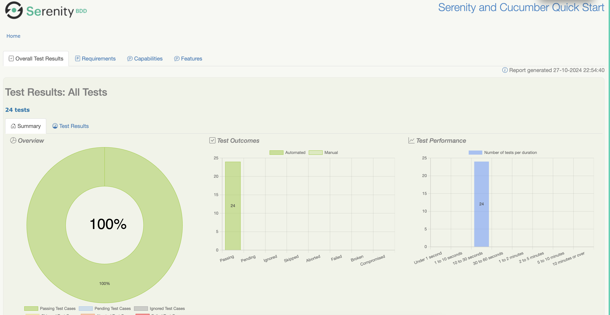
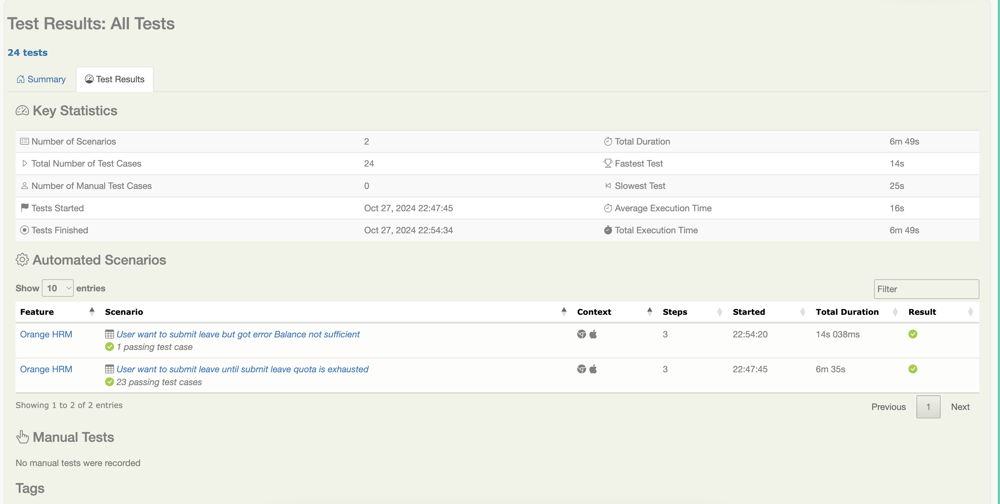
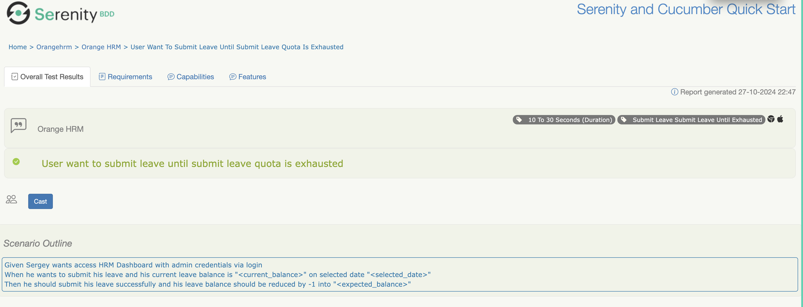
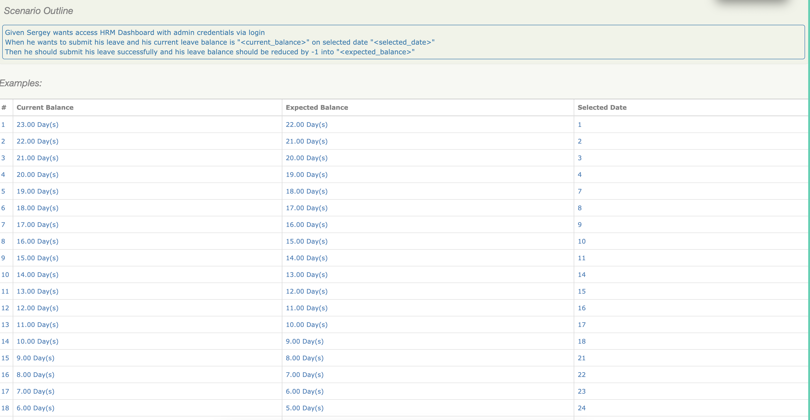
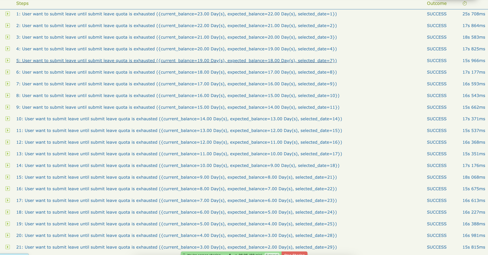

# Orange HRM Leave Feature with Serenity BDD and Cucumber

This repository is designed to demonstrate on how to test apply leave feature on OrangeHRM open source web https://opensource-demo.orangehrmlive.com/ using Serenity BDD with Cucumber

# Getting started with Serenity and Cucumber

Serenity BDD is a library that makes it easier to write high quality automated acceptance tests, with powerful reporting and living documentation features. It has strong support for both web testing with Selenium, and API testing using RestAssured.

Serenity strongly encourages good test automation design, and supports several design patterns, including classic Page Objects, the newer Lean Page Objects/ Action Classes approach, and the more sophisticated and flexible Screenplay pattern.

The latest version of Serenity supports Cucumber 6.x.

### The project directory structure
The project has build scripts for both Maven and Gradle, and follows the standard directory structure used in most Serenity projects:
```Gherkin
src
  + main
  + test
    + java                        Test runners and supporting code
    + resources
      + features                  Feature files

    + orangehrm                  Feature file subdirectories

             orangehrm_submit_leave.feature
```

Serenity 2.2.13 introduced integration with WebdriverManager to download webdriver binaries.

## Executing the tests
To run the sample project, you can either just run the `CucumberTestSuite` test runner class, or run either `mvn verify` or `gradle test` from the command line.

By default, the tests will run using Chrome. You can run them in Firefox by overriding the `driver` system property, e.g.
```json
$ mvn clean verify -Ddriver=firefox
```
Or
```json
$ gradle clean test -Pdriver=firefox
```

The test results will be recorded in the `target/site/serenity` directory.

## Run the tests in specific test scenarios
You can run specific scenario by using:
```json
$ mvn clean verify -Dcucumber.filter.tags="@submit_leave_with_comments"
```

## Generating the reports
Since the Serenity reports contain aggregate information about all of the tests, they are not generated after each individual test (as this would be extremenly inefficient). Rather, The Full Serenity reports are generated by the `serenity-maven-plugin`. You can trigger this by running `mvn serenity:aggregate` from the command line or from your IDE.

They reports are also integrated into the Maven build process: the following code in the `pom.xml` file causes the reports to be generated automatically once all the tests have completed when you run `mvn verify`?

```
             <plugin>
                <groupId>net.serenity-bdd.maven.plugins</groupId>
                <artifactId>serenity-maven-plugin</artifactId>
                <version>${serenity.maven.version}</version>
                <configuration>
                    <tags>${tags}</tags>
                </configuration>
                <executions>
                    <execution>
                        <id>serenity-reports</id>
                        <phase>post-integration-test</phase>
                        <goals>
                            <goal>aggregate</goal>
                        </goals>
                    </execution>
                </executions>
            </plugin>
```

## Simplified WebDriver configuration and other Serenity extras
The sample projects both use some Serenity features which make configuring the tests easier. In particular, Serenity uses the `serenity.conf` file in the `src/test/resources` directory to configure test execution options.  
### Webdriver configuration
The WebDriver configuration is managed entirely from this file, as illustrated below:
```java
webdriver {
    driver = chrome
}
headless.mode = true

chrome.switches="""--start-maximized;--test-type;--no-sandbox;--ignore-certificate-errors;
                   --disable-popup-blocking;--disable-default-apps;--disable-extensions-file-access-check;
                   --incognito;--disable-infobars,--disable-gpu"""

```

Serenity uses WebDriverManager to download the WebDriver binaries automatically before the tests are executed.

### Environment-specific configurations
We can also configure environment-specific properties and options, so that the tests can be run in different environments. Here, we configure three environments, __dev__, _staging_ and _prod_, with different starting URLs for each:
```json
environments {
  default {
    webdriver.base.url = "https://duckduckgo.com"
  }
  dev {
    webdriver.base.url = "https://duckduckgo.com/dev"
  }
  staging {
    webdriver.base.url = "https://duckduckgo.com/staging"
  }
  prod {
    webdriver.base.url = "https://duckduckgo.com/prod"
  }
}
```

You use the `environment` system property to determine which environment to run against. For example to run the tests in the staging environment, you could run:
```json
$ mvn clean verify -Denvironment=staging
```

See [**this article**](https://johnfergusonsmart.com/environment-specific-configuration-in-serenity-bdd/) for more details about this feature.

## Want to learn more?
For more information about Serenity BDD, you can read the [**Serenity BDD Book**](https://serenity-bdd.github.io/theserenitybook/latest/index.html), the official online Serenity documentation source. Other sources include:
* **[Learn Serenity BDD Online](https://expansion.serenity-dojo.com/)** with online courses from the Serenity Dojo Training Library
* **[Byte-sized Serenity BDD](https://www.youtube.com/channel/UCav6-dPEUiLbnu-rgpy7_bw/featured)** - tips and tricks about Serenity BDD
* For regular posts on agile test automation best practices, join the **[Agile Test Automation Secrets](https://www.linkedin.com/groups/8961597/)** groups on [LinkedIn](https://www.linkedin.com/groups/8961597/) and [Facebook](https://www.facebook.com/groups/agiletestautomation/)
* [**Serenity BDD Blog**](https://johnfergusonsmart.com/category/serenity-bdd/) - regular articles about Serenity BDD

## Run your test in Docker
you need to set up a Docker environment that includes all dependencies, as well as a way to run the tests from within the container. Here's a guide to help you get started:

### Create a Dockerfile
* The Dockerfile defines the environment in which your tests will run.
* Here is a sample Dockerfile for a Serenity BDD project using Maven:
```dockerfile
# Use an official JDK image as a base
FROM maven:3.8.6-openjdk-11

# Set the working directory in the container
WORKDIR /app

# Copy the pom.xml and download dependencies
COPY pom.xml /app/
RUN mvn dependency:resolve

# Copy the rest of the project files into the container
COPY . /app

# Run the tests
CMD ["mvn", "clean", "verify"]

```

### Build the Docker Image
* Open your terminal in the project directory (where the Dockerfile is located). 
* Run the following command to build your Docker image, replacing serenity-docker with the name you want for your image:
```shell
docker build -t serenity-docker .
```

### Run the Tests in the Docker Container
* Use the following command to run the Docker container with the tests:
```shell
docker run -it --rm serenity-docker
```
* This will start a container, execute the tests as defined in the CMD in the Dockerfile, and then remove the container.

### View Test Results
* Results are stored in target/site/serenity/. You can mount a volume to access this output locally.
```shell
docker run -it --rm -v $(pwd)/target:/app/target serenity-docker
```

## Jenkins to run Automation Test
To set up Jenkins to run Serenity BDD with Cucumber tests inside a Docker container, follow these steps to install Jenkins, configure it to use Docker, and set up a Jenkins job to run your tests.

### Prerequisites
* Docker should be installed on the machine where Jenkins will run.
* Java, Maven, and Serenity BDD setup in your automation project.

### Step 1: Install Docker
* Install Docker (if not already installed).
* On Ubuntu:
```shell
sudo apt update
sudo apt install docker.io
```
* Verify the installation:
```shell
docker --version
```

### Step 2: Run Jenkins in Docker
Run Jenkins in a Docker container and link it to the Docker host for running containers within Jenkins jobs.

* Start Jenkins with Docker access:
```shell
docker run -d -p 8080:8080 -p 50000:50000 --name jenkins \
-v jenkins_home:/var/jenkins_home \
-v /var/run/docker.sock:/var/run/docker.sock \
jenkins/jenkins:lts
```
* Access Jenkins UI:
  * Go to http://localhost:8080 in your browser.
  * Complete the setup steps, including installing recommended plugins and setting up an admin user.

### Step 3: Install Jenkins Plugins for Docker and Pipelines
* Go to Manage Jenkins > Manage Plugins.
* Install the following plugins:
  * Docker (for Docker support).
  * Pipeline (for creating pipeline jobs).
  * Environment Injector (optional, for environment variables).

### Step 4: Create a Dockerfile for Your Serenity Project
* Create a Dockerfile in your project root to build a Docker image with Java, Maven, and any additional dependencies:

```Dockerfile
# Use a Maven image with Java 11
FROM maven:3.8.1-openjdk-11

# Set working directory
WORKDIR /app

# Copy the project files to the container
COPY . /app

# Install dependencies and run tests
RUN mvn clean install
```
* Build the Docker image for your Serenity BDD project:

```shell
docker build -t serenity-bdd-image .
```

### Step 5: Create a Jenkins Pipeline Job
* In Jenkins, create a New Item > Pipeline and give it a name (e.g., “Serenity BDD Tests”).
* Configure the Pipeline:
  * Scroll down to the Pipeline section.
  * Choose Pipeline script.

### Step 6: Write the Jenkinsfile Pipeline Script
* Add a Jenkinsfile at the root of your project with the following script, or copy this into the pipeline configuration:

```groovy
pipeline {
agent any

    environment {
        DOCKER_IMAGE = 'serenity-bdd-image'
    }

    stages {
        stage('Checkout Code') {
            steps {
                // Replace with your repository URL
                git url: 'https://github.com/your-repo/your-serenity-project.git', branch: 'main'
            }
        }

        stage('Build Docker Image') {
            steps {
                script {
                    // Build Docker image for the project
                    docker.build("${DOCKER_IMAGE}", '.')
                }
            }
        }

        stage('Run Tests') {
            steps {
                script {
                    // Run Docker container with the test command
                    docker.image("${DOCKER_IMAGE}").inside {
                        sh 'mvn clean verify -Dcucumber.options="--tags @yourTag"'
                    }
                }
            }
        }
    }

    post {
        always {
            // Archive Serenity test results and screenshots
            archiveArtifacts artifacts: 'target/site/serenity/*'
            publishHTML(target: [
                allowMissing: false,
                alwaysLinkToLastBuild: true,
                keepAll: true,
                reportDir: 'target/site/serenity',
                reportFiles: 'index.html',
                reportName: 'Serenity Test Report'
            ])
        }
    }
}
```

### Step 7: Configure Jenkins Job Settings
* Set up Build Triggers:
  * Go to Build Triggers and configure as needed (e.g., Poll SCM, Build Periodically).
* Save and Run:
  * Save the pipeline job and select Build Now to test. 
  * This pipeline script will:
    * Pull the latest code from your repository. 
    * Build the Docker image. 
    * Run tests in the container. 
    * Publish the Serenity test report. 
 
### Step 8: View Test Results
* Once the job completes, go to the Build page.
* Check the Serenity Test Report under HTML Publisher for a detailed test report.

### Optional: Clean Up Docker Resources
To free up space by removing old images and containers, you can add a cleanup stage:
```groovy
post {
    cleanup {
        sh 'docker system prune -f'
    }
}
```

## Sample Serenity BDD Reports 
On Scenario Test OrangeHRM submit leave until exhausted, you can see the report : 
* Project Main
  * open leave until exhausted report folder : 
    * site
      * serenity
        * index.html

### Report Screenshots





